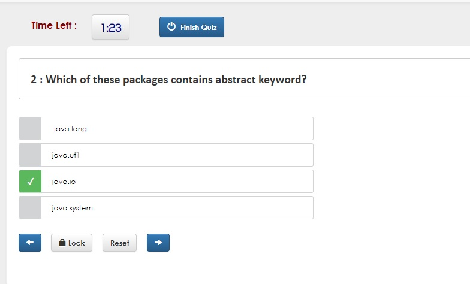
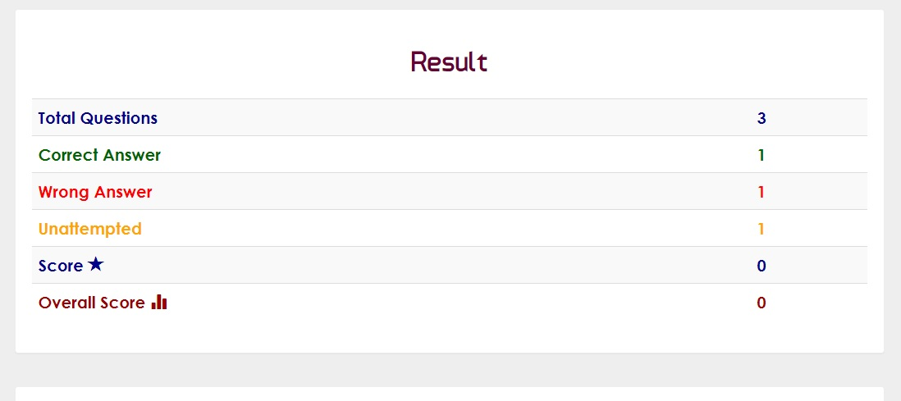
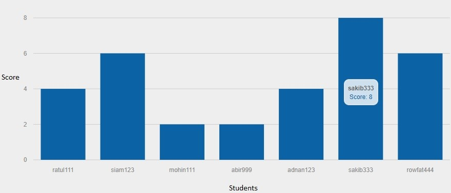

# VIRTUAL CLASSROOM
 
This is a university course project. The Virtual Classroom allows teachers and students to perform their educational activities.    

------------------------------

> Frontend: Html5, CSS3, Bootstrap4, Jquery 

> Backend: PHP, Javascript and MySQL

-----------------------------

## Features

A. Teachers can create multiple classes and each class contains a unique class code.  
B. Students can join to a class using the class code.  
C. Teachers can take MCQ based exam.  
D. Teachers can give Assignments to students.  
E. Auto-Assessment of students' performace.  
F. Teachers can see the results of a particular class or a specific course.   
G. Data Analytics of students' performance.  

-------------------------

### 1. REAL-TIME MCQ EXAM

 

i. Faculty creating exam question  

 

ii. Exam portal  

 

iii. Auto-assessment of Exam  

 

 

-------------------------

### 2. ASSIGNMENT 

 

i. Faculty creating assignment

 

ii. Students viewing assignment

 

iii. Submission portal

 

-------------------------

### 3. DATA ANALYTICS

 

Statistical data visualization of class performance is created which helps to see the data using bar chart. Faculty can also see the data analytics of a particular exam for specific class. 

 

-----------------------------

North South university 

